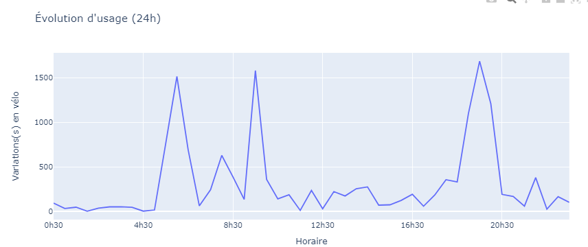

# Les vélibs

Nous nous sommes intéressés à l'utilisation des vélibs dans l'Île-de-France. \
Peut-on clairement discerner des pics d'utilisation ainsi que des creux ?

Laissons parler les données.

## Aspiration des données.

Nous avons accès aux données [opendata.paris](https://opendata.paris.fr/explore/dataset/velib-disponibilite-en-temps-reel/information/?disjunctive.name&disjunctive.is_installed&disjunctive.is_renting&disjunctive.is_returning&disjunctive.nom_arrondissement_communes). \
Nous avons donc cherché à les mettre à profit. \
Problème : Ces données sont des données temps réel, et donc des données à un instant T.

Nous avons donc fait un script Python d'aspiration des données situé dans `./data/`, nommé `fetch.py`. \
Les données aspirées se retrouvent dans le dossier `./data/velib/`, les fichiers suivant cette norme de nommage : `AAAA_MM_JJ_HH_MM_velib.csv`. \
Pour un accès direct aux données, cliquer [ici](https://opendata.paris.fr/explore/dataset/velib-disponibilite-en-temps-reel/download/?format=csv&timezone=Europe/Berlin&lang=fr&use_labels_for_header=true&csv_separator=%3B). \
On a récupéré les données sur la plage 14h54 le 10 mars 2022 - 16h17 le 12 mars 2022.

Cela nous donne une journée complète à exploitée, le 11 mars 2022. Ce que nous feront ensuite.

## Traitement des données

Les fichiers récupérés contiennet des informations sur le bornes des vélibs. On n'a seulement leur identifiant. \
Il nous faut un système pour les regrouper par département.

### Données annexes :

#### GeoJSON

Nous avons récupéré les données des communes, grace à [GeoJSON](https://france-geojson.gregoiredavid.fr/), plus précisément sur ce [lien](https://france-geojson.gregoiredavid.fr/repo/regions/ile-de-france/communes-ile-de-france.geojson).

#### Population

Nous avons aussi eu besoin des données de population par communes / arrondissement. \
Nous avons utilisé cette [api](https://public.opendatasoft.com), plus précisément, ce [point terminal](https://public.opendatasoft.com/api/records/1.0/search/?dataset=correspondance-code-insee-code-postal&facet=insee_com&facet=nom_dept&facet=nom_region&facet=statut)

### Nettoyage

La première chose à faire était de retirer les colonnes / les renommer.
Le script dans `./data/`, nommé `clean_csv.py` s'en ai chargé.
Ce script récupère aussi les informations sur les polygonnes de chaques communes et assigne une bornes à celles-ci.

### Groupement

On souhaite récupérer les données concernant chacune des communes, et non pas des bornes individuelles. \
On a regroupé les données grâce au script dans `./data/`, nommé `groupby.py`. Les données sont donc groupées par arrondissement / communes.

### Connecter nos données vélibs aux données population

Le script dans `./data/`, nommé `connect_data.py` s'en ai chargé. \
Il récupère les données groupés et assigne à chaque arrondissement / communes sa population. \
Il rajoute dans notre dataframe final plusieurs clé pour que l'on puisse tester quelle méthode met en avant nos résultats.

- `ratio_pop` le ratio de vélib disponible par rapport à la population.
- `ratio_pop_log2` le ratio de vélib disponible par rapport à la population, log2.
- `ratio_pop_log10` le ratio de vélib disponible par rapport à la population, log10.
- `ratio_avail` le ratio de vélib disponible par rapport au nombre d'emplacement vélib au sein de la commune / arrondissement.
- `ratio_avail_log2` le ratio de vélib disponible par rapport au nombre d'emplacement vélib au sein de la commune / arrondissement, log2.
- `ratio_avail_log10` le ratio de vélib disponible par rapport au nombre d'emplacement vélib au sein de la commune / arrondissement, log10.
- `ratio_avail_glob` le ratio de vélib disponible par rapport au nombre d'emplacement vélib total.

Au final nous avons choisi la clé `ratio_avail` pour montrer nos données.

### Fluctuations

Pour montrer au mieux les fluctuations dans les usages de vélib, nous avons calculé, à l'aide du script dans `./data/`, nommé `difference.py`, le delta de vélib disponibles entre deux instants (toutes les 30 minutes).

## Conclusion

On remarque grâce à ce graphique, que il y a bien des heures de pointes, deux le matin et une le soir.
